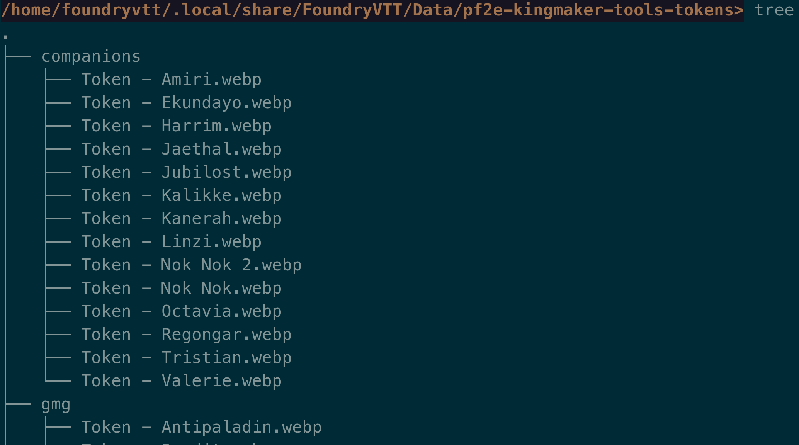
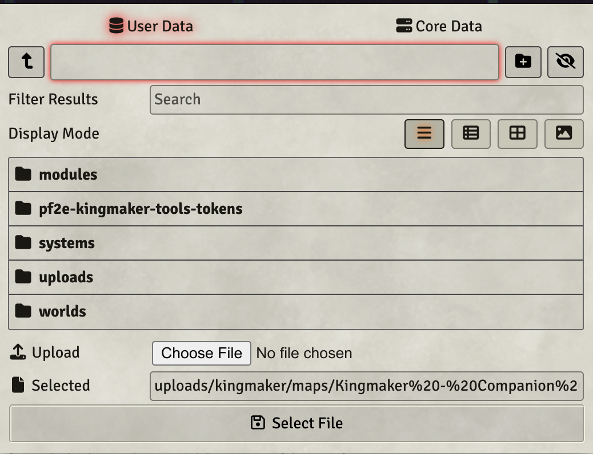
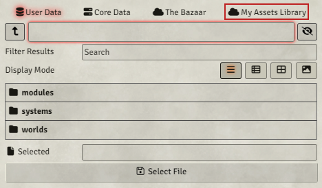

# Kingmaker Tools Token Mapping (Unofficial)

This module ships predefined token mappings for the Kingmaker Adventure Path for Pathfinder 2nd Edition. The contents of this module have previously been included in the [Kingmaker Tools](https://github.com/BernhardPosselt/pf2e-kingmaker-tools) module but has been pulled out, so that you can both use the Tools module and the official Kingmaker module.

**Do not install this module if you are using the official Kingmaker module!**

**Note**: Structure mappings still ship with the [Tools](https://github.com/BernhardPosselt/pf2e-kingmaker-tools) module

## Installation

The package is available through the [module registry](https://foundryvtt.com/packages/pf2e-kingmaker-tools-token-mapping)

### Git

Clone this repository into your installation's module folder:

    cd ~/.local/share/FoundryVTT/Data/modules
    git clone https://github.com/BernhardPosselt/pf2e-kingmaker-tools-token-mapping.git 

If your Foundry instance is running, you need to restart it to clear its module cache.

## Usage

**Note**: This module does not and can not ship any art! You are responsible for placing the appropriate images in the
described folder structure. See further down for how the folder needs to be organized.

The module ships with a settings to auto-configure all tokens from the adventure path by looking up files in a certain
folder. If you don't want that, remove the following lines from the **module.json** file:

```json
{
  "flags": {
    "pf2e-kingmaker-tools": {
      "pf2e-art": "modules/pf2e-kingmaker-tools/map.json"
    }
  }
}
```

The tokens integrate with the [Token Pack](https://foundryvtt.com/packages/pf2e-tokens-bestiaries) and expect the other
tokens to be placed into your **Data/pf2e-kingmaker-tools-tokens/** directory under the following paths:





**The Forge**: If you are using The Forge, you need to place the folder in **My Asset Library** instead. If a file is
not found under User Data, The Forge will instead try to look it up under the same path in **My Asset Library** instead.



* **kingmaker/Token - Aecora Silverfire.webp**
* **kingmaker/Token - Agai.webp**
* **kingmaker/Token - Akiros.webp**
* **kingmaker/Token - Akuzhail.webp**
* **kingmaker/Token - Alasen.webp**
* **kingmaker/Token - Ameon Trask.webp**
* **kingmaker/Token - Annamede Belavarah.webp**
* **kingmaker/Token - Armag.webp**
* **kingmaker/Token - Auchs.webp**
* **kingmaker/Token - Avatar of the Lantern King.webp**
* **kingmaker/Token - Barbtongued Wyvern.webp**
* **kingmaker/Token - Black Tear Cutthroat.webp**
* **kingmaker/Token - Bloom Cultist 2.webp**
* **kingmaker/Token - Bloom of Lamashtu.webp**
* **kingmaker/Token - Bloom Wyvern.webp**
* **kingmaker/Token - Bog Mummy Cultist.webp**
* **kingmaker/Token - Brush Thylacine.webp**
* **kingmaker/Token - Castruccio Irovetti.webp**
* **kingmaker/Token - Cephal Lorentus.webp**
* **kingmaker/Token - Chief Sootscale.webp**
* **kingmaker/Token - Cleansed Cultist.webp**
* **kingmaker/Token - Corax.webp**
* **kingmaker/Token - Cursed Guardian.webp**
* **kingmaker/Token - Cyclops Zombie.webp**
* **kingmaker/Token - Darivan.webp**
* **kingmaker/Token - Davik Nettles.webp**
* **kingmaker/Token - Defaced Naiad Queen.webp**
* **kingmaker/Token - Dog.webp**
* **kingmaker/Token - Dovan.webp**
* **kingmaker/Token - Drelev Guard.webp**
* **kingmaker/Token - Elga Verniex.webp**
* **kingmaker/Token - Elk.webp**
* **kingmaker/Token - Endless Struggle.webp**
* **kingmaker/Token - Engelidis.webp**
* **kingmaker/Token - Eobald.webp**
* **kingmaker/Token - Evindra.webp**
* **kingmaker/Token - False Priestess.webp**
* **kingmaker/Token - Fetch.webp**
* **kingmaker/Token - Fetch.webp**
* **kingmaker/Token - Fionn.webp**
* **kingmaker/Token - Foras.webp**
* **kingmaker/Token - Gaetane.webp**
* **kingmaker/Token - Gedovius.webp**
* **kingmaker/Token - General Avinash Jurg.webp**
* **kingmaker/Token - Ghostly Guard.webp**
* **kingmaker/Token - Goblin Bat-Dog.webp**
* **kingmaker/Token - Grabbles.webp**
* **kingmaker/Token - Grigori 2.webp**
* **kingmaker/Token - Gromog.webp**
* **kingmaker/Token - Gurija.webp**
* **kingmaker/Token - Hannis Drelev 2.webp**
* **kingmaker/Token - Happs Bydon.webp**
* **kingmaker/Token - Hargulka.webp**
* **kingmaker/Token - Hateful Hermit.webp**
* **kingmaker/Token - Hillstomper.webp**
* **kingmaker/Token - Hooktongue.webp**
* **kingmaker/Token - Horagnamon.webp**
* **kingmaker/Token - Ilora Nuski.webp**
* **kingmaker/Token - Ilthuliak.webp**
* **kingmaker/Token - Castruccio Irovetti.webp**
* **kingmaker/Token - Jaggedbriar Hag.webp**
* **kingmaker/Token - Jamandi Aldori.webp**
* **kingmaker/Token - Jin Durwhimmer.webp**
* **kingmaker/Token - Jurgrindor.webp**
* **kingmaker/Token - Kargstaad.webp**
* **kingmaker/Token - Kargstaads Giant.webp**
* **kingmaker/Token - Kereek.webp**
* **kingmaker/Token - King Vesket.webp**
* **kingmaker/Token - Kob Moleg.webp**
* **kingmaker/Token - Korog.webp**
* **kingmaker/Token - Kressle.webp**
* **kingmaker/Token - Kundal Werewolf.webp**
* **kingmaker/Token - Leng Envoy.webp**
* **kingmaker/Token - Lesser Jabberwock.webp**
* **kingmaker/Token - Lickweed.webp**
* **kingmaker/Token - Lintwerth.webp**
* **kingmaker/Token - Lizardfolk Warrior.webp**
* **kingmaker/Token - Logger.webp**
* **kingmaker/Token - Malgorzata Niska.webp**
* **kingmaker/Token - Mandragora Swarm.webp**
* **kingmaker/Token - Mastiff of Tindalos.webp**
* **kingmaker/Token - Elk.webp**
* **kingmaker/Token - Melianse.webp**
* **kingmaker/Token - Minognos-Ushad.webp**
* **kingmaker/Token - Nighmare Rook.webp**
* **kingmaker/Token - Nilak.webp**
* **kingmaker/Token - Nishkiv.webp**
* **kingmaker/Token - Ntavi.webp**
* **kingmaker/Token - Nugrah.webp**
* **kingmaker/Token - Nyrissa 2.webp**
* **kingmaker/Token - Old Crackjaw.webp**
* **kingmaker/Token - Oleg.webp**
* **kingmaker/Token - Pavetta Stroon.webp**
* **kingmaker/Token - Phomandala.webp**
* **kingmaker/Token - Pitax Warden.webp**
* **kingmaker/Token - Prazil.webp**
* **kingmaker/Token - Primal Bandersnatch.webp**
* **kingmaker/Token - Qunitessa Maray.webp**
* **kingmaker/Token - Rickety Bridge.webp**
* **kingmaker/Token - Rigg Gargadilly.webp**
* **kingmaker/Token - Fetch.webp**
* **kingmaker/Token - Satinder Morne.webp**
* **kingmaker/Token - Sepoko.webp**
* **kingmaker/Token - Sir Fredo Sinnet.webp**
* **kingmaker/Token - Sister of the Bloodshot Eye.webp**
* **kingmaker/Token - Skeletal Tiger Lord.webp**
* **kingmaker/Token - Smoke-Filled Hallway.webp**
* **kingmaker/Token - Stinging Nettle.webp**
* **kingmaker/Token - Svetlana.webp**
* **kingmaker/Token - Talon Peak Roc.webp**
* **kingmaker/Token - Tartuk.webp**
* **kingmaker/Token - Terrion Numesti.webp**
* **kingmaker/Token - The Beast.webp**
* **kingmaker/Token - The Dancing Lady.webp**
* **kingmaker/Token - The First Faithful.webp**
* **kingmaker/Token - The Gardener.webp**
* **kingmaker/Token - The Horned Hunter.webp**
* **kingmaker/Token - The Knurly Witch.webp**
* **kingmaker/Token - The Lonely Warrior.webp**
* **kingmaker/Token - The Misbegotten Troll.webp**
* **kingmaker/Token - The Stag Lord.webp**
* **kingmaker/Token - The Wriggling Man.webp**
* **kingmaker/Token - Threshold Disciple.webp**
* **kingmaker/Token - Threshold Hermeticist.webp**
* **kingmaker/Token - Threshold Mystic.webp**
* **kingmaker/Token - Brush Thylacine.webp**
* **kingmaker/Token - Tiger Lord.webp**
* **kingmaker/Token - Trapdoor Ogre Spider.webp**
* **kingmaker/Token - Tree That Weeps.webp**
* **kingmaker/Token - Troll Guard.webp**
* **kingmaker/Token - Tulvak.webp**
* **kingmaker/Token - Unstable Pit.webp**
* **kingmaker/Token - Vilderavn Herald.webp**
* **kingmaker/Token - Villamor Koth.webp**
* **kingmaker/Token - Virthad.webp**
* **kingmaker/Token - Volodmyra.webp**
* **kingmaker/Token - Vordakai.webp**
* **kingmaker/Token - Werendegar.webp**
* **kingmaker/Token - Whimwyrm.webp**
* **kingmaker/Token - Wild Hunt Archer.webp**
* **kingmaker/Token - Wild Hunt Horse.webp**
* **kingmaker/Token - Wild Hunt Hound.webp**
* **kingmaker/Token - Wild Hunt Monarch.webp**
* **kingmaker/Token - Wild Hunt Scout.webp**
* **kingmaker/Token - Winged Owlbear.webp**
* **kingmaker/Token - Xae.webp**
* **kingmaker/Token - Zorek.webp**
* **companions/Token - Harrim.webp**
* **companions/Token - Jaethal.webp**
* **companions/Token - Kanerah.webp**
* **companions/Token - Kalikke.webp**
* **companions/Token - Octavia.webp**
* **companions/Token - Regongar.webp**
* **gmg/Token - Bandit.webp**
* **gmg/Token - Hunter.webp**
* **gmg/Token - Antipaladin.webp**
* **gmg/Token - Bandit.webp**
* **gmg/Token - Barkeep.webp**
* **gmg/Token - Bodyguard.webp**
* **gmg/Token - Bounty Hunter.webp**
* **gmg/Token - Cultist.webp**
* **gmg/Token - Guard.webp**
* **gmg/Token - Hunter.webp**
* **gmg/Token - Mage for Hire.webp**
* **gmg/Token - Monster Hunter.webp**
* **gmg/Token - Noble.webp**
* **gmg/Token - Palace Guard.webp**
* **gmg/Token - Poacher.webp**
* **gmg/Token - Ruffian.webp**
* **gmg/Token - Servant.webp**
